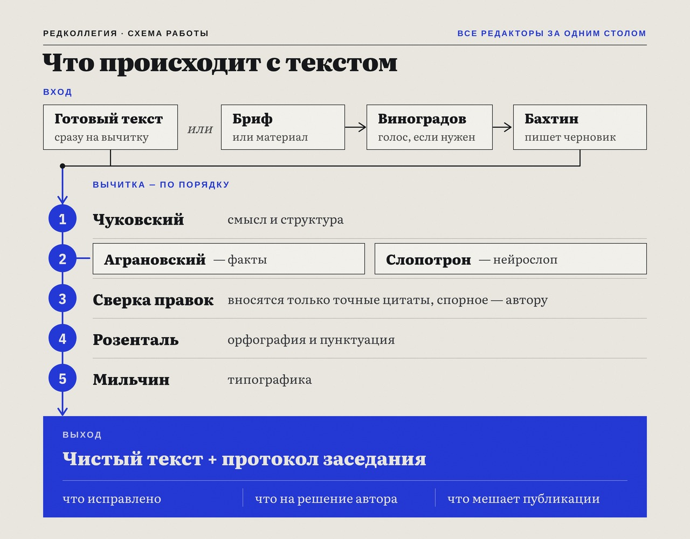

<p align="center">
  
</p>

# Редколлегия

> **Claude Code-скил (команда `/redkollegiya`): дирижёр редактуры. Один вход, который сам определяет режим обработки и прогоняет текст через всю семью редакторских скилов — от генерации черновика до финальной типографики — и сводит решения в один отчёт. Сама ничего не пишет и не правит: маршрутизирует, разводит зоны редакторов, а их правки вносит детерминированный скрипт по дословным цитатам. Три ветки по содержанию входа: готовый текст → Вычитка, бриф/материал → Полный цикл, готовый текст + смена голоса → Рерайт.**

[](LICENSE)
[](https://docs.claude.com/en/docs/claude-code/overview)
[](https://www.python.org/)

Даёте текст или бриф — Claude сам понимает, что с ним делать. Готовый пост прогонит по конвейеру
вычитки (смысл → факты → AI-маркеры → норма → типографика) и вернёт чистый текст с единым отчётом.
Если на входе только бриф или расшифровка, сначала закажет черновик у генератора и проверит голос,
а потом вычитает. Редколлегия — это все редакторы семьи за одним столом: у каждого своя зона, спорить
за одну запятую им не дают, а решения собираются в один протокол.

```
/redkollegiya <вставьте пост>
→ Trace: вход → класс готовый текст → ветка Вычитка; фактчек быстрый; язык ru.
→ Конвейер: Чуковский → Аграновский ∥ Слопотрон → single-apply (7 внесено / 2 автору)
→           → Розенталь → Мильчин (54 правки).
→ 🔴 Блокеры: нет. На решение автора: 3 спорных места.
→ ИТОГОВЫЙ ТЕКСТ: …
```

---

## Зачем

Пять редакторских скилов семьи закрывают каждый свою зону: смысл, факты, AI-маркеры, норму,
типографику. По отдельности это пять запусков, пять отчётов, ручная развязка «кто за что отвечает»
и порядок, который легко перепутать: поставьте типографику до правок — и неразрывные пробелы
слетят, когда модель перепечатает текст.

Редколлегия сажает всех за один стол. Она:
- **сама определяет режим** по содержанию входа (готовый текст, сырьё, смена голоса);
- **держит канонический порядок** и пускает дорогой фактчек параллельно с детектором AI-маркеров;
- **сводит пять шкал серьёзности в одну** (blocker / fix / author_choice) и отдаёт единый отчёт;
- **вносит правки скриптом** по дословным цитатам редакторов, а не переписывает текст «от себя»;
- **разводит зоны**, чтобы два редактора не правили одно и то же место.

У редколлегии нет своего пера. Текст пишет автор (или генератор по его брифу), правят редакторы,
каждый в своей зоне, а Редколлегия ведёт заседание и пишет протокол: что внесено, что осталось
на решение автора, что мешает публикации.

## Как работает

Три этажа семьи под одним дирижёром:

1. **Голос** (Виноградов) — если нужен авторский голос, Редколлегия проверяет, собран ли профиль; нет — предлагает собрать.
2. **Генерация** (Бахтин) — если на входе только материал или бриф, Редколлегия заказывает черновик у генератора.
3. **Вычитка** (пятёрка) — канонический конвейер:

**Чуковский → (Аграновский ∥ Слопотрон) → single-apply → Розенталь → Мильчин**
(смысл → истина + детектор → применение находок → буква → форма).

Чуковский и Розенталь переписывают текст сами. Аграновский и Слопотрон текст не трогают: они
возвращают находки, у каждой — дословная цитата из текста и дословная замена. Мильчин —
детерминированный скрипт-типограф, он всегда идёт последним.

**Single-apply — главное отличие от наивной цепочки.** Если отдать находки фактчекера и детектора
модели со словами «внеси», она заодно подправит соседнее слово, пропустит конфликт двух правок или
допишет абзац. Поэтому находки Аграновского и Слопотрона вносит скрипт `apply.py`, без модели:
- правка ищется по дословной цитате; цитата не нашлась или встречается в тексте дважды — находка
  уходит автору, скрипт не угадывает;
- две правки задевают один фрагмент или предлагают для одной цитаты разные замены — обе уходят
  автору;
- у правок есть бюджет роста: вместе они не могут раздуть текст больше чем на 20%. Сверх бюджета
  вытесняются самые «раздувающие» правки, но исправление факта не вытесняется никогда: это ошибка,
  а не стиль;
- выдуманный факт без верного значения не «чинится» — он остаётся блокером, и Редколлегия прямо
  пишет, что публиковать такой текст нельзя. Так же с противоречием внутри текста: если в одном
  абзаце «продажи выросли на 40%», а в другом «выручка упала вдвое», Чуковский не выбирает цифру
  за автора, а ставит блокер;
- значение `action` у каждой находки — из закрытого списка; всё непонятное скрипт в текст не
  вносит, а отдаёт автору.

Сколько знаков добавили или сняли редакторы-переписчики, скрипт тоже проверяет: если Чуковский
раздул текст или на лонгриде потерялся абзац, это будет видно в отчёте.

<p align="center">
  
</p>

## Режимы (авто по входу)

Режим не задаётся флагом — Редколлегия выбирает его сама, по содержанию входа (а не по метке файла
или глаголу команды):

| На входе | Ветка | Что происходит |
|---|---|---|
| **готовый текст** (хук → тело → концовка, пригоден к публикации) | **Вычитка** | конвейер пятёрки |
| **сырьё** (бриф, тезисы, расшифровка-материал, тема) | **Полный цикл** | проверка голоса → генерация → вычитка |
| **готовый текст + «перепиши в голосе X»** | **Рерайт** | генерация в новом голосе с сохранением смысла и фактов → вычитка |
| **сигналы конфликтуют** | **Гейт** | Редколлегия задаёт один уточняющий вопрос |

Плюс независимые оси: режим вычитки (Правка / Разбор), объём, глубина фактчека (быстрый / полный /
выкл), число агентов генерации. Подробности — в SKILL.

## Зависимости

**Редколлегия ничего не делает сама — она ведёт заседание.** Работают установленные скилы семьи,
поэтому до Редколлегии поставьте тех, кто за столом:

**Обязательно (вычитка):**
- [Чуковский](https://github.com/beaverbeard/chukovsky) — смысл, структура, голос, канцелярит
- [Аграновский](https://github.com/beaverbeard/agranovsky) — верификация фактов (числа, цитаты, законы, ссылки)
- [Слопотрон](https://github.com/beaverbeard/slopotron) — AI-маркеры и нейрослоп
- [Розенталь](https://github.com/beaverbeard/rozental) — орфография, пунктуация, согласование, единообразие
- [Мильчин](https://github.com/beaverbeard/milchin) — типографика и юникод-гигиена

**Для Полного цикла и Рерайта (генерация):**
- [Бахтин](https://github.com/beaverbeard/bakhtin) — генерация черновика (multi-agent, 7 форматов)
- [Виноградов](https://github.com/beaverbeard/vinogradov) — сборка авторского голоса (Voice DNA) из корпуса

Если какого-то скила нет в установке, Редколлегия скажет об этом и не станет выдумывать его работу.
Для вычитки готового текста хватит пятёрки; Бахтин и Виноградов нужны, только когда на входе сырьё
или нужна смена голоса.

Сам скрипт `apply.py` — чистый Python 3.8+ без зависимостей.

## Установка

Копируйте **всю папку скила** — рядом с `SKILL.md` лежит `apply.py`, без него single-apply не
заработает.

```bash
# В конкретный проект:
git clone https://github.com/beaverbeard/redkollegiya.git
cp -r redkollegiya/.claude/skills/redkollegiya      .claude/skills/
cp    redkollegiya/.claude/commands/redkollegiya.md .claude/commands/

# Глобально:
cp -r redkollegiya/.claude/skills/redkollegiya      ~/.claude/skills/
cp    redkollegiya/.claude/commands/redkollegiya.md ~/.claude/commands/

# Проверка скрипта:
python3 ~/.claude/skills/redkollegiya/apply.py --selftest

# Перезапустите Claude Code — скил «Редколлегия» (redkollegiya) и команда /redkollegiya появятся в списке.
```

Не забудьте поставить семью (см. «Зависимости»), иначе за столом никого не будет.

## Использование

```bash
/redkollegiya <текст поста>          # вычитка готового текста
/redkollegiya <путь к брифу.md>      # полный цикл: генерация → вычитка
/redkollegiya разбери этот текст     # режим Разбор: флаги без правок
/redkollegiya полный фактчек <текст> # вычитка с полной проверкой фактов
```

Или просто вызовите `/redkollegiya` и вставьте текст следующим сообщением. Скил срабатывает и на
обычные просьбы: «прогони через редколлегию», «вычитай целиком», «полная вычитка».

Редколлегия напечатает decision-trace (как она классифицировала вход и какие оси выбрала), прогонит
конвейер и вернёт один сводный отчёт: блокеры, ключевые флаги, «на решение автора», факт-флаги
с источниками — и итоговый текст.

## Что Редколлегия делает

- Определяет режим обработки по содержанию входа.
- Держит порядок этапов и пускает фактчек параллельно с детектором AI-маркеров.
- Сводит пять нативных шкал в одну ось серьёзности (blocker / fix / author_choice).
- Вносит `fix` и `blocker` с дословной правкой через скрипт; спорное и вкусовое выносит «на решение автора».
- Разводит зоны, чтобы этапы не дублировали друг друга.
- Собирает единый отчёт и один итоговый текст.

## Что Редколлегия НЕ делает

- **Не пишет текст сама** — генерацию делегирует Бахтину.
- **Не придумывает правок** — вносит только дословные замены из находок редакторов; где нужна
  авторская формулировка (выдуманный факт без верного значения, конфликт двух правок, неоднозначная
  цитата), выносит вопрос «на решение автора» и за автора не решает.
- **Не лезет в чужие зоны** — не переставляет запятые (это Розенталь), не правит типографику
  вручную (это Мильчин), не проверяет факты сама (это Аграновский).
- **Не перезаписывает ваш файл молча** — итог показывает в отчёте, в исходный файл пишет только
  после вашего «ок».
- **Не собирает телеметрию** — не отправляет ваш текст никуда, кроме вызовов модели и веб-поиска
  фактчекера.

## Ограничения

- Заточена под **русский текст** (Мильчин и Розенталь — русская норма и типографика). Нерусский
  вход — предупредит.
- Качество этапов равно качеству установленных скилов семьи; Редколлегия их не заменяет.
- Single-apply держится на дисциплине этапов: если редактор дал неточную цитату, правка не
  внесётся и уйдёт автору. Это сделано намеренно — лучше лишний вопрос, чем тихая порча текста.
- Полный цикл дороже вычитки (генерация + пять этапов), на большом входе Редколлегия предупредит
  о стоимости.

## FAQ

**Нужно ли ставить все семь скилов?** Для вычитки готового текста — пятёрку (chukovsky, agranovsky,
slopotron, rozental, milchin). Бахтин и Виноградов нужны только для генерации и смены голоса.

**Чем это отличается от запуска скилов по очереди?** Редколлегия сама выбирает режим, держит
порядок, запускает этапы параллельно, где можно, сводит пять отчётов в один, а находки фактчекера
и детектора вносит скриптом, который не умеет «чуть-чуть подправить» соседнее слово.

**Она перепишет мой текст своими словами?** Нет. Своих формулировок у Редколлегии нет: переписывают
Чуковский и Розенталь, каждый в своей зоне, остальное вносит скрипт дословно. Всё спорное уходит
в раздел «на решение автора», решаете вы.

**Зачем бюджет роста?** Вычитка должна чистить текст, а не дописывать. Если правки вместе раздувают
текст больше чем на 20%, это уже переписывание — лишнее уходит к автору на решение.

## Вклад

Замечания и PR — welcome. Скил исполняется чтением, так что правки логики — это правки
Markdown-инструкций; маршрутизация живёт в секции «Ядро решений» SKILL. Если меняете `apply.py`,
прогоните `python3 apply.py --selftest` — все тесты должны пройти.

## Скилы для рИИдакторов

Редколлегия — оркестратор семьи **[рИИдактор](https://redaktozavr.ru/rAIdactor?utm_source=skills)**,
рассылки про работу редактора с ИИ. Каждый скил семьи закрывает свою зону, не пересекаясь,
а Редколлегия ведёт всю цепочку:

| Скил | Зона | Природа |
|------|------|---------|
| [Виноградов](https://github.com/beaverbeard/vinogradov) | Сборка авторского голоса (Voice DNA) из корпуса | Скрипт + LLM |
| [Бахтин](https://github.com/beaverbeard/bakhtin) | Генерация черновика: multi-agent, 7 форматов | LLM |
| [Чуковский](https://github.com/beaverbeard/chukovsky) | Смысл, структура, голос, канцелярит | LLM |
| [Аграновский](https://github.com/beaverbeard/agranovsky) | Верификация фактов: числа, цитаты, законы, ссылки | LLM + поиск |
| [Слопотрон](https://github.com/beaverbeard/slopotron) | AI-маркеры и нейрослоп | LLM |
| [Розенталь](https://github.com/beaverbeard/rozental) | Орфография, пунктуация, согласование, единообразие | LLM |
| [Мильчин](https://github.com/beaverbeard/milchin) | Типографика и юникод-гигиена | Скрипт |
| **Редколлегия** | **Дирижёр: гоняет текст через всю цепочку и сводит результат** | **Оркестратор + скрипт** |

Канонический порядок при полной вычитке:
**Чуковский → (Аграновский ∥ Слопотрон) → Розенталь → Мильчин** (смысл → истина + детектор → буква → форма).
Аграновский — обязательный фактчек, идёт параллельно Слопотрону сразу за Чуковским.

## Лицензия

MIT — см. [LICENSE](LICENSE).
